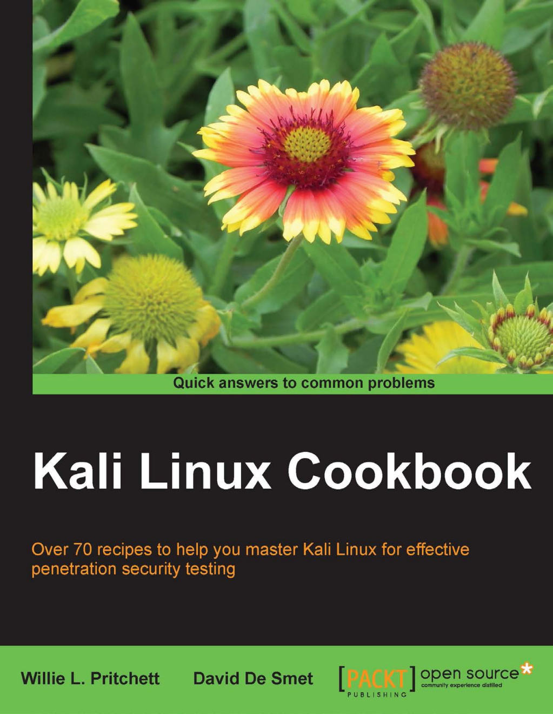

## Kali Linux 秘籍 中文版

[原书：Kali Linux Cookbook](https://www.packtpub.com/networking-and-servers/kali-linux-cookbook)	

[GitBook在线阅读，PDF、ePub、Mobi电子书下载](https://www.gitbook.com/book/alleniverson/linux-cheats/details)

## 目录

* [第一章 安装和启动Kali](ch1.md)
* [第二章 定制 Kali Linux](ch2.md)
* [第三章 高级测试环境](ch3.md)
* [第四章 信息收集](ch4.md)
* [第五章 漏洞评估](ch5.md)
* [第六章 漏洞利用](ch6.md)
* [第七章 权限提升](ch7.md)
* [第八章 密码攻击](ch8.md)
* [第九章 无线攻击](ch9.md)

## 关注我

- Email：<815712739@qq.com>
- CSDN博客：[Allen Iverson](http://blog.csdn.net/axi295309066)
- 新浪微博：[AndroidDeveloper](http://weibo.com/u/1848214604?topnav=1&wvr=6&topsug=1&is_all=1)
- GitHub：[JackChan1999](https://github.com/JackChan1999)
- GitBook：[alleniverson](https://www.gitbook.com/@alleniverson)
- 个人博客：[JackChan](https://jackchan1999.github.io/)