## 第四章 信息收集

### 简介

攻击的重要阶段之一就是信息收集。为了能够实施攻击，我们需要收集关于目标的基本信息。我们获得的信息越多，攻击成功的概率就越高。

我也强调这一阶段的一个重要方面，它就是记录。在编写这本书的时候，最新的Kali发行版包含了一组工具用于帮助我们核对和组织来自目标的数据，以便我们更好地侦查目标。类似Maltego CaseFile和 KeepNote的工具就是一个例子。

### 4.1 服务枚举

在这个秘籍中，我们将会展示一些服务枚举的小技巧。枚举是我们从网络收集信息的过程。我们将要研究DNS枚举和SNMP枚举技术。DNS枚举是定位某个组织的所有DNS服务器和DNS条目的过程。DNS枚举允许我们收集有关该组织的重要信息，例如用户名、计算机名称、IP地址以及其它。为了完成这些任务我们会使用DNSenum。对于SNMP枚举，我们会使用叫做SnmpEnum的工具，它是一个强大的SNMP枚举工具，允许我们分析网络上的SNMP流量。

#### 操作步骤

让我们以DNS枚举作为开始：

1.我们使用DNSenum进行DNS枚举。为了开始DNS枚举，打开Gnome终端，并且输入以下命令：

```
cd /usr/bin
./dnsenum --enum adomainnameontheinternet.com
```

> 请不要在不属于你的公共网站或者不是你自己的服务器上运行这个工具。这里我们将`adomainnameontheinternet.com`作为一个例子，你应该替换掉这个目标。要当心！

2.我们需要获取信息输出，例如主机、名称服务器、邮件服务器，如果幸运的话还可以得到区域转换：


3.我们可以使用一些额外的选项来运行DNSenum，它们包括这些东西：

+   `-- threads [number]`允许你设置一次所运行的线程数量。
+   `-r`允许你开启递归查找。
+   `-d`允许你设置在WHOIS请求之间的时间延迟，单位为秒。
+   `-o`允许我们制定输出位置。
+   `-w`允许我们开启WHOIS查询。

> 更多WHOIS上的例子，请见[WHOIS的维基百科](http://en.wikipedia.org/wiki/Whois)。

4.我们可以使用另一个命令`snmpwalk`来检测Windows主机。Snmpwalk是一个使用SNMP GETNEXT请求在网络实体中查询信息树的SNMP应用。在命令行中键入下列命令：

```
snmpwalk -c public 192.168.10.200 -v 2c
```

5.我们也可以枚举安装的软件：

```
snmpwalk -c public 192.168.10.200 -v 1 | grep  hrSWInstalledName

HOST-RESOURCES-MIB::hrSWInstalledName.1 = STRING: "VMware  Tools"
HOST-RESOURCES-MIB::hrSWInstalledName.2 = STRING: "WebFldrs"
```

6.以及使用相同工具枚举开放的TCP端口：

```
snmpwalk -c public 192.168.10.200 -v 1 | grep tcpConnState |  cut -d"." -f6 | sort –nu

21
25
80
443
```

7.另一个通过SNMP收集信息的工具叫做`snmpcheck`：

```
cd /usr/bin
snmpcheck -t 192.168.10.200
```

8.为了使用fierce（一个尝试多种技术来寻找所有目标所用的IP地址和域名的工具）进行域名扫描，我们可以键入以下命令：

```
cd /usr/bin
fierce -dns adomainnameontheinternet.com
```

> 请不要在不属于你的公共网站或者不是你自己的服务器上运行这个工具。这里我们将`adomainnameontheinternet.com`作为一个例子，你应该替换掉这个目标。要当心！

9.为了以指定的词语列表进行相同的操作，键入以下命令：

```
fierce -dns adomainnameontheinternet.com -wordlist  hosts.txt -file /tmp/output.txt
```

10.为了在SMTP服务器上启动用户的SMTP枚举，键入以下命令：

```
smtp-user-enum -M VRFY -U /tmp/users.txt -t 192.168.10.200
```

11.我们现在可以记录所获得的结果了。

### 4.2 判断网络范围

使用上一节中我们所收集的信息，我们就能着眼于判断目标网络的IP地址范围。在这个秘籍中我们将要探索完成它所用的工具。

#### 操作步骤

让我们通过打开终端窗口来开始判断网络范围：

1.打开新的终端窗口，并且键入以下命令：

```
dmitry -wnspb targethost.com -o /root/Desktop/dmitry-result
```

2.完成之后，我们应该在桌面上得到了一个文本文件，名称为`dmitry-result.txt`，含有收集到的目标信息：

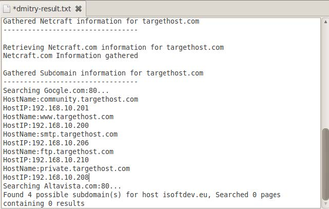

3.键入以下命令来执行ICMP netmask请求：

```
netmask -s targethost.com
```

4.使用scapy，我们就可以执行并行路由跟踪。键入以下命令来启动它：

```
scapy
```

5.scapy启动之后，我们现在可以输入以下函数：

```
ans,unans=sr(IP(dst="www.targethost.com/30", ttl=(1,6))/TCP()
```

6.我们可以输入以下函数来将结果展示为表格：

```
ans.make_table( lambda (s,r): (s.dst, s.ttl, r.src) )
```

结果如下：

```
216.27.130.162  216.27.130.163  216.27.130.164 216.27.130.165  
1 192.168.10.1   192.168.10.1    192.168.10.1   192.168.10.1     
2 51.37.219.254  51.37.219.254   51.37.219.254  51.37.219.254   
3 223.243.4.254  223.243.4.254   223.243.4.254  223.243.4.254   
4 223.243.2.6    223.243.2.6     223.243.2.6    223.243.2.6     
5 192.251.254.1  192.251.251.80  192.251.254.1  192.251.251.80
```

7.我们需要键入以下函数来使用scapy获得TCP路由踪迹：

```
res,unans=traceroute(["www.google.com","www.Kali- linux.org","www.targethost.com"],dport=[80,443],maxttl=20, retry=-2)
```

8.我们只需要键入以下函数来将结果展示为图片：

```
res.graph()
```


9.保存图片只需要下列命令：

```
res.graph(target="> /tmp/graph.svg")
```

10.我们可以生成3D展示的图片，通过键入下列函数来实现：

```
res.trace3D()
```

11.键入以下命令来退出scapy：

```
exit()
```

12.在获得结果之后，我们现在可以对其做记录。

#### 工作原理

在步骤1中，我们使用了`dmitry`来获取目标信息。参数`-wnspub`允许我们在域名上执行WHOIS查询，检索`Netcraft.com`的信息，搜索可能的子域名，以及扫描TCP端口。选项`-o`允许我们将结果保存到文本文件中。在步骤3中，我们建立了一个简单的ICMP netmask请求，带有`-s`选项，来输出IP地址和子网掩码。接下来，我们使用scapy来执行目标上的并行路由跟踪，并在表格中展示结果。在步骤7中，我们在不同主机的80和443端口上执行了TCP路由跟踪，并且将最大TTL设置为20来停止这个过程。在获得结果之后，我们创建了它的图片表示，将它保存到临时目录中，同时创建了相同结果的3D表示。最后，我们退出了scapy。

### 4.3 识别活动主机

在尝试渗透之前，我们首先需要识别目标网络范围内的活动主机。

一个简单的方法就是对目标网络执行`ping`操作。当然，这可以被主机拒绝或忽略，这不是我们希望的。

#### 操作步骤

让我们打开终端窗口，开始定位活动主机：

1.我们可以使用Nmap来判断某个主机是否打开或关闭，像下面这样：

```
nmap -sP 216.27.130.162

Starting Nmap 5.61TEST4 ( http://nmap.org ) at 2012-04-27  23:30 CDT
Nmap scan report for test-target.net (216.27.130.162)
Host is up (0.00058s latency).
Nmap done: 1 IP address (1 host up) scanned in 0.06 seconds
```

2.我们也可以使用Nping（Nmap组件），它提供给我们更详细的结果：

```
nping --echo-client "public" echo.nmap.org
```

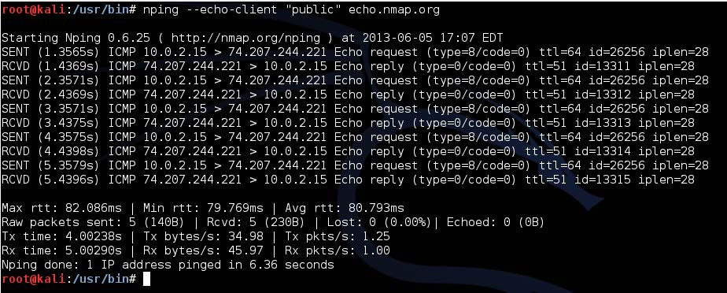

3.我们也可以向指定端口发送一些十六进制数据：

```
nping -tcp -p 445 –data AF56A43D 216.27.130.162
```

### 4.4 寻找开放端口

在了解目标网络范围和活动主机之后，我们需要执行端口扫描操作来检索开放的TCP和UDP端口和接入点。

#### 准备

完成这个秘籍需要启动Apache Web服务器。

#### 操作步骤

让我们通过打开终端窗口，开始寻找开放端口：

1.运行终端窗口并输入下列命令作为开始：

```
nmap 192.168.56.101
```

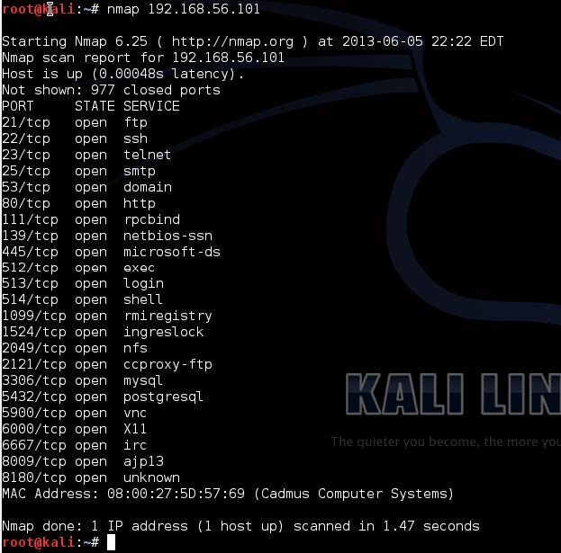

2.我们也可以显式指定要扫描的端口（这里我们指定了1000个端口）：

```
nmap -p 1-1000 192.168.56.101
```

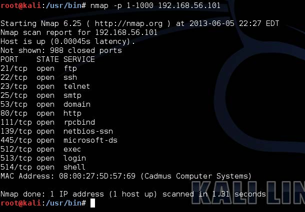

3.或指定Nmap来扫描某个组织所有网络的TCP 22端口：

```
nmap -p 22 192.168.56.*
```

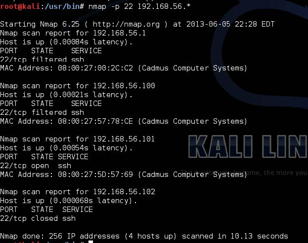

4.或者以特定格式输出结果：

```
nmap -p 22 192.168.10.* -oG /tmp/nmap-targethost-tcp445.tx
```

#### 工作原理

这个秘籍中，我们使用Nmap来扫描我们网络上的目标主机，并判断开放了哪个端口。


#### 更多

Nmap的GUI版本叫做Zenmap，它可以通过在终端上执行`zenmap`命令，或者访问`Applications | Kali Linux | Information Gathering | Network Scanners | zenmap`来启动。

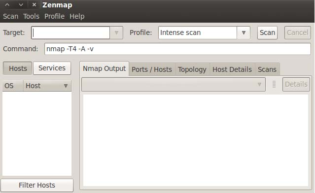

### 4.5 操作系统指纹识别

到信息收集的这个步骤，我们应该记录了一些IP地址，活动主机，以及所识别的目标组织的开放端口。下一步就是判断活动主机上运行的操作系统，以便了解我们所渗透的系统类型。

#### 准备

需要用到Wireshark捕获文件来完成这个秘籍的步骤2。

#### 操作步骤

让我们在终端窗口中进行OS指纹识别：

1.我们可以使用Nmap执行下列命令，带有`-O`命令来开启OS检测功能：

```
nmap -O 192.168.56.102
```

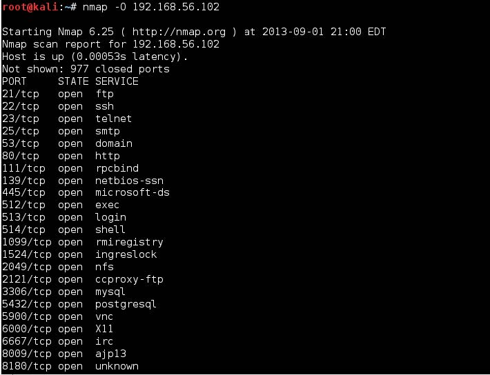

2.使用`p0f`来分析Wireshark捕获文件：

```
p0f -s /tmp/targethost.pcap -o p0f-result.log -l

p0f - passive os fingerprinting utility, version 2.0.8
(C) M. Zalewski <lcamtuf@dione.cc>, W. Stearns  
<wstearns@pobox.com>
p0f: listening (SYN) on 'targethost.pcap', 230 sigs (16  generic), rule: 'all'.
[+] End of input file.
```

### 4.6 服务指纹识别

判断运行在特定端口上的服务是目标网络上成功渗透的保障。它也会排除任何由OS指纹之别产生的疑惑。

#### 操作步骤

让我们通过开始终端窗口来进行服务指纹识别：

1.打开终端窗口并键入以下命令：

```
nmap -sV 192.168.10.200

Starting Nmap 5.61TEST4 ( http://nmap.org ) at 2012-03-28  05:10 CDT
Interesting ports on 192.168.10.200:
Not shown: 1665 closed ports
PORT STATE SERVICE VERSION
21/tcp open ftp Microsoft ftpd 5.0
25/tcp open smtp Microsoft ESMTP 5.0.2195.6713
80/tcp open http Microsoft IIS webserver 5.0
119/tcp open nntp Microsoft NNTP Service 5.0.2195.6702  (posting ok)
135/tcp open msrpc Microsoft Windows RPC
139/tcp open netbios-ssn
443/tcp open https?
445/tcp open microsoft-ds Microsoft Windows 2000 microsoft-ds
1025/tcp open mstask Microsoft mstask
1026/tcp open msrpc Microsoft Windows RPC
1027/tcp open msrpc Microsoft Windows RPC
1755/tcp open wms?
3372/tcp open msdtc?
6666/tcp open nsunicast Microsoft Windows Media Unicast  Service (nsum.exe)

MAC Address: 00:50:56:C6:00:01 (VMware)
Service Info: Host: DC; OS: Windows

Nmap finished: 1 IP address (1 host up) scanned in 63.311  seconds
```

2.我们也可以使用`amap`来识别运行在特定端口或端口范围内的应用，比如下面这个例子：

```
amap -bq 192.168.10.200 200-300

amap v5.4 (www.thc.org/thc-amap) started at 2012-03-28  06:05:30 - MAPPING mode
Protocol on 127.0.0.1:212/tcp matches ssh - banner: SSH-2.0- OpenSSH_3.9p1\n
Protocol on 127.0.0.1:212/tcp matches ssh-openssh - banner:  SSH-2.0-OpenSSH_3.9p1\n
amap v5.0 finished at 2005-07-14 23:02:11
```

### 4.7 Maltego 风险评估

在这个秘籍中，我们将要开始使用Maltego的特殊Kali版本，它可以在信息收集阶段协助我们，通过将获得的信息以易于理解的形式展示。Maltego是开源的风险评估工具，被设计用来演示网络上故障单点的复杂性和严重性。它也具有从内部和外部来源聚合信息来提供简洁的风险图表的能力。

#### 准备

需要一个账号来使用Maltego。访问[https://www.paterva.com/web6/community/](https://www.paterva.com/web6/community/)来注册账号。

#### 操作步骤

让我们从启动Maltego开始：

1.访问` Applications | Kali Linux | Information Gathering | OSINT Analysis | maltego`来启动Maltego。窗口如下：

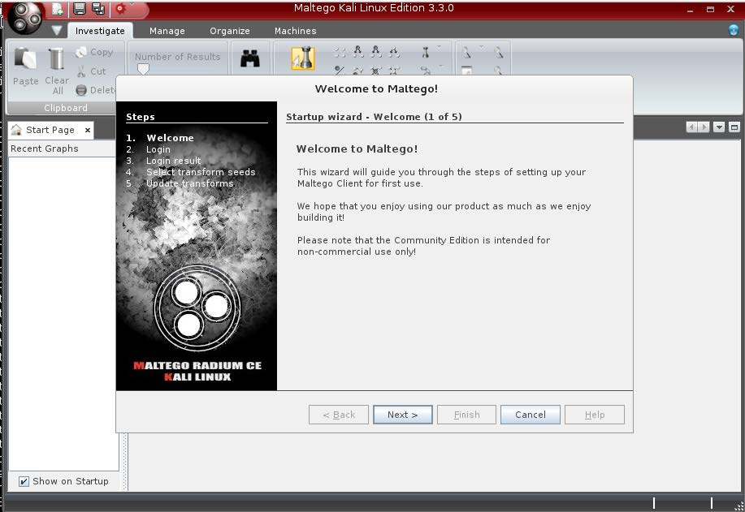

2.点击开始向导的`Next`来查看登录细节：

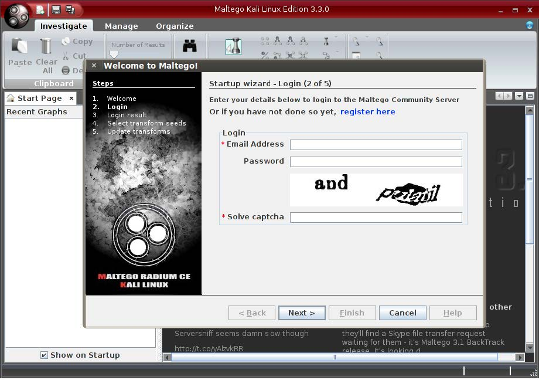

3.点击`Next`来验证我们的登录凭证。验证之后，点击`Next`以继续：

4.选择transform seed设置，之后点击`Next`：

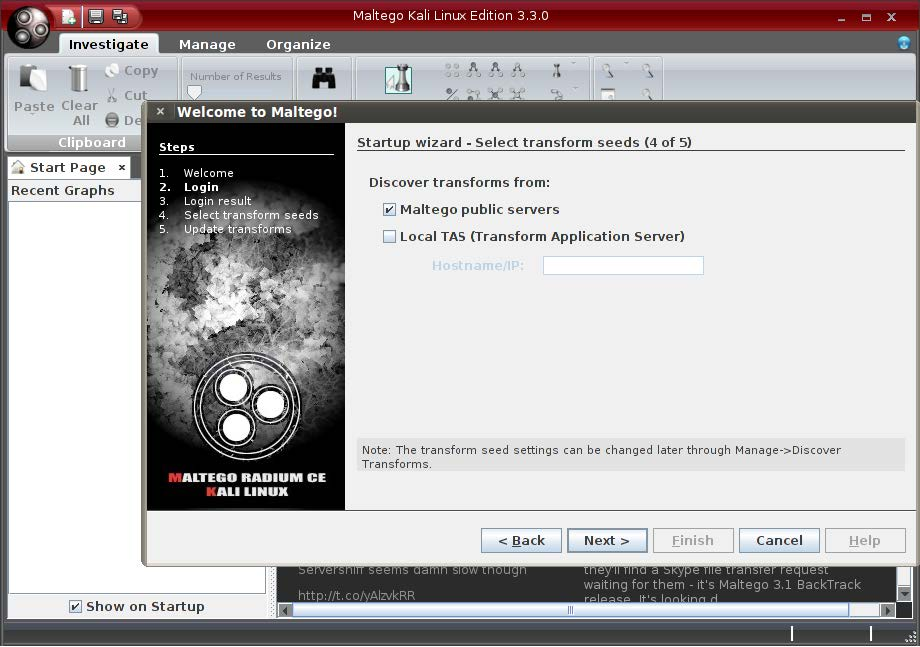

5.这个向导在跳到下个页面之前会执行多次操作。完成之后，选择`Open a blank graph and let me play around`并点击`Finish`。

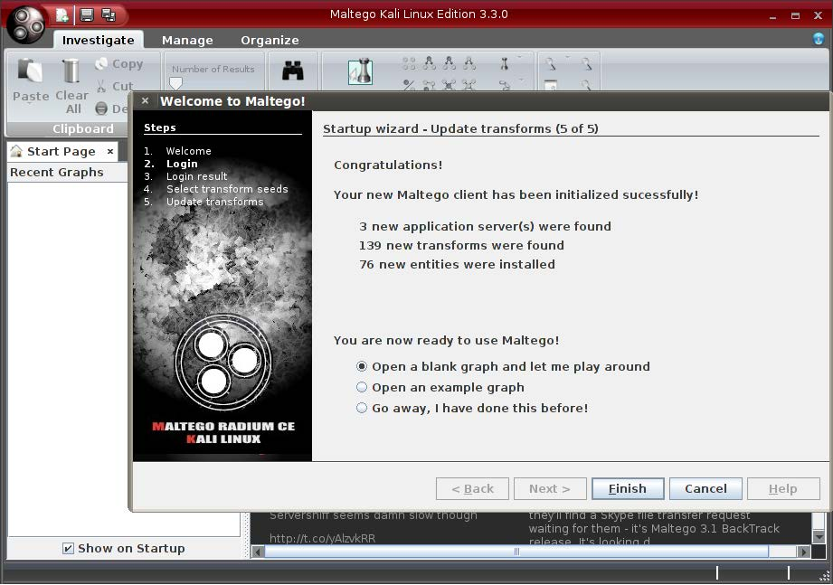

6.最开始，将`Domain`实体从`Palette`组件拖放到`New Graph`标签页中。

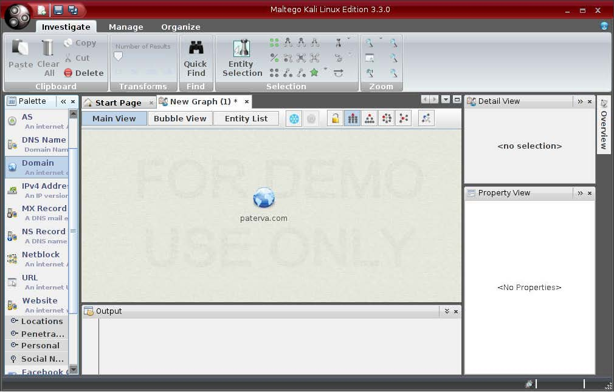

7.通过点击创建的`Domain`实体来设置目标域名，并且编辑`Property View`中的`Domain Name`属性。

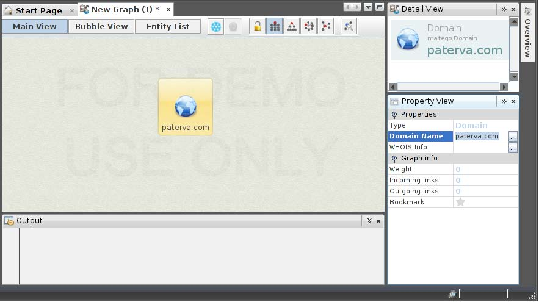

8.目标一旦设置好，我们就可以开始收集信息了。最开始，右键点击创建的`Domain`实体，并且选择`Run Transform`来显示可用的选项：

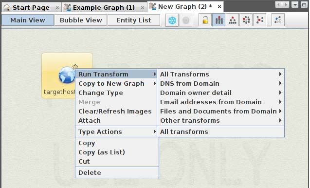

9.我们可以选择查找DNS名称，执行WHOIS查询，获得邮件地址，以及其它。或者我们还可以选择运行下面展示的全部转换。

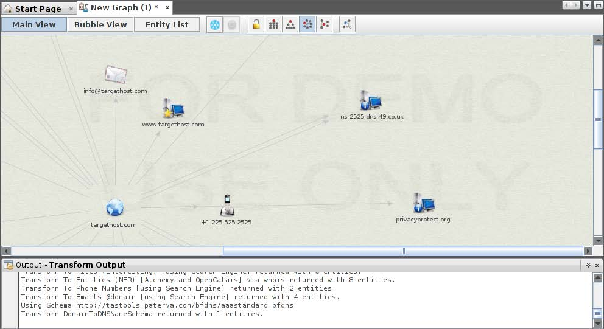

10.我们甚至可以通过在链接的子节点上执行相同操作，来获得更多信息，直到我们找到了想要的信息。

#### 工作原理

在这个秘籍中，我们使用Maltego来映射网络。Maltego是一个开源工具，用于信息收集和取证，由Paterva出品。我们通过完成开始向导来开始这个秘籍。之后我们使用`Domain`实体，通过将它拖到我们的图表中。最后，我们让Maltego完成我们的图表，并且查找各种来源来完成任务。Maltego十分有用，因为我们可以利用这一自动化的特性来快速收集目标信息，例如收集邮件地址、服务器的信息、执行WHOIS查询，以及其它。

> 社区版只允许我们在信息收集中使用75个转换。Maltego的完整版需要$650。

#### 更多

启用和禁用转换可以通过`Manage`标签栏下方的`Transform Manager`窗口设置：

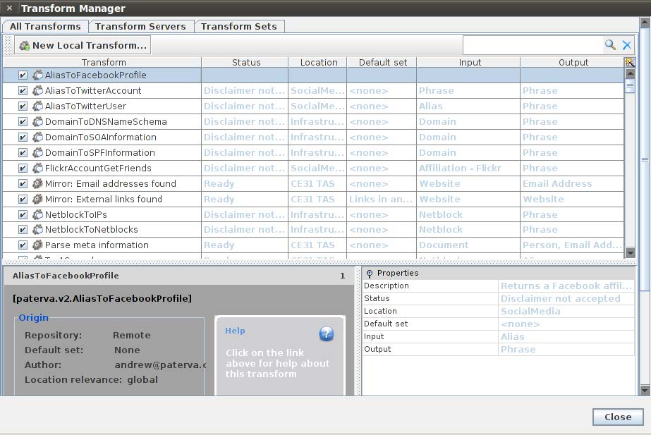

一些转换首先需要接受才可以使用。

### 4.8 映射网络

使用前面几个秘籍获得的信息，我们就可以创建该组织网络的蓝图。在这一章的最后一个·秘籍中，我们会了解如何使用Maltego CaseFile来可视化地编译和整理所获得的信息。

`CaseFile`就像开发者的网站上那样，相当于不带转换的Maltego，但拥有大量特性。多数特性会在这个秘籍的“操作步骤”一节中展示。

#### 操作步骤

当我们从启动CaseFile来开始：

1.访问`Applications | Kali Linux | Reporting Tools | Evidence Management | casefile`来启动CaseFile。

2.点击CaseFile应用菜单的`New`来创建新的图表：

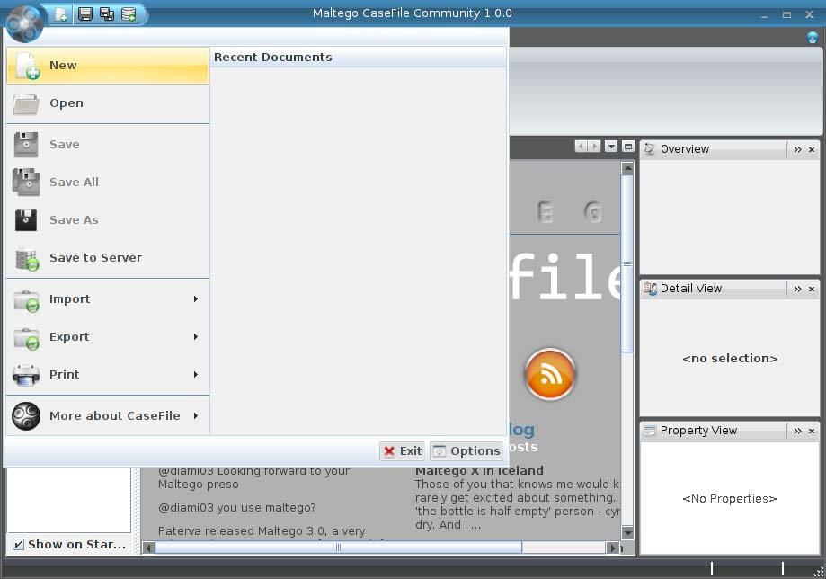

3.就像Maltego那样，我们将每个实体从`Palette`组建拖放到图表标签页中。让我们从拖放`Domain`实体以及修改`Domain Name`属性来开始。

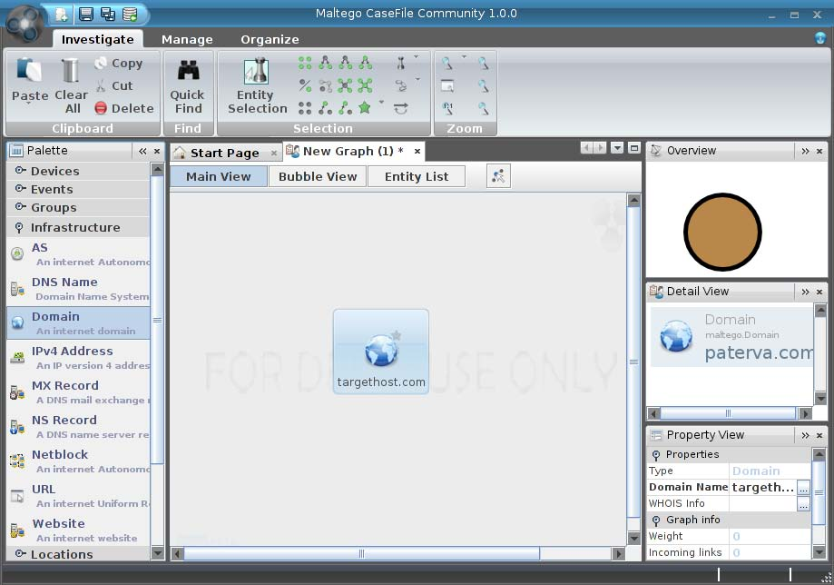

4.将鼠标指针置于实体上方，并且双击注解图标来添加注解。

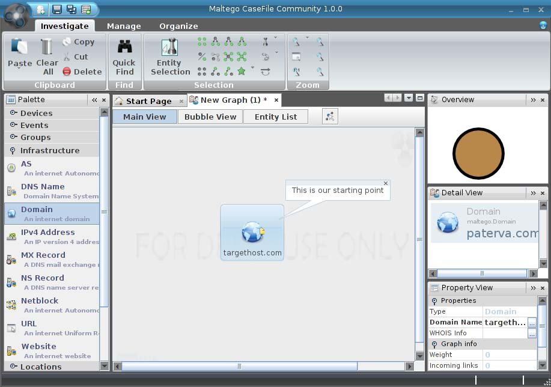

5.让我们拖放另一个实体来记录目标的DNS信息：

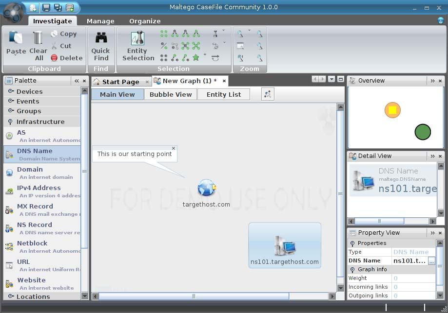

6.链接实体只需要在实体之前拖出一条线：

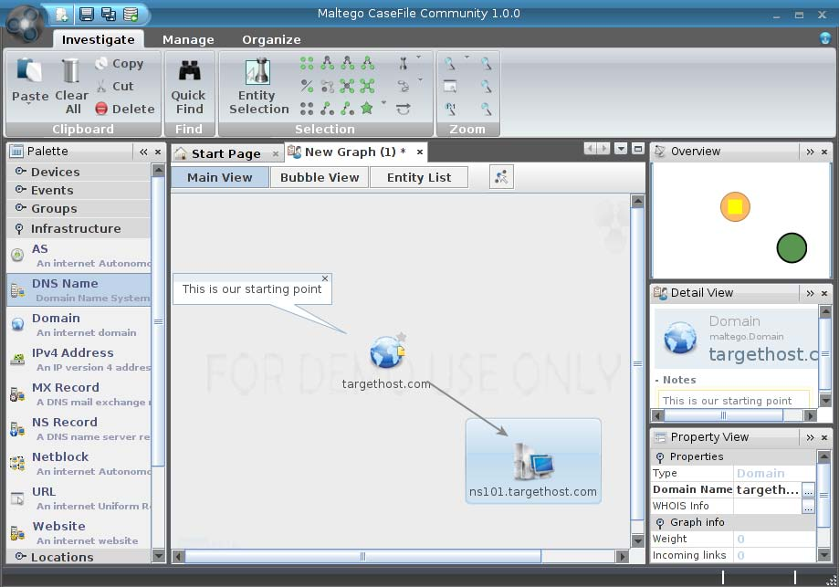

7.按需自定义链接的属性：

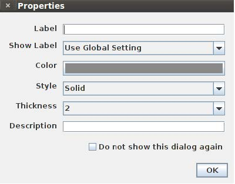

8.重复步骤5~7来向图中添加更多关于该组织网络的信息。

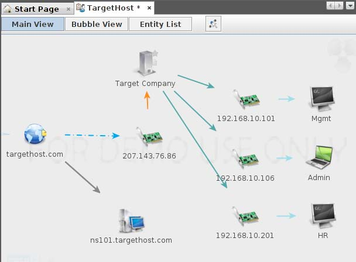

9.最后我们保存了信息图表。图表的记录可以在之后打开和编辑，如果我们需要的话，和我们从已知目标获得更多信息的情况一样。

#### 工作原理

在这个秘籍中，我们使用Maltego CaseFile来映射网络。CaseFile是个可视化的智能应用，可以用于判断数百个不同类型信息之间的关系和现实世界的联系。它的本质是离线情报，也就是说它是个手动的过程。我们以启动CaseFile并且创建新的图表作为开始。接下来，我们使用了收集到或已知的目标网络信息，并且开始向图表中添加组件来做一些设置。最后保存图表来结束这个秘籍。

#### 更多

我们也可以加密图表记录，使它在公众眼里更安全。为了加密图表，需要在保存的时候选择`Encrypt (AES-128)`复选框并提供一个密码。
